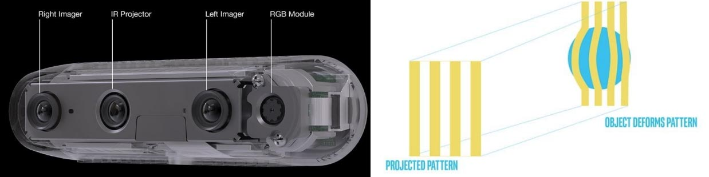
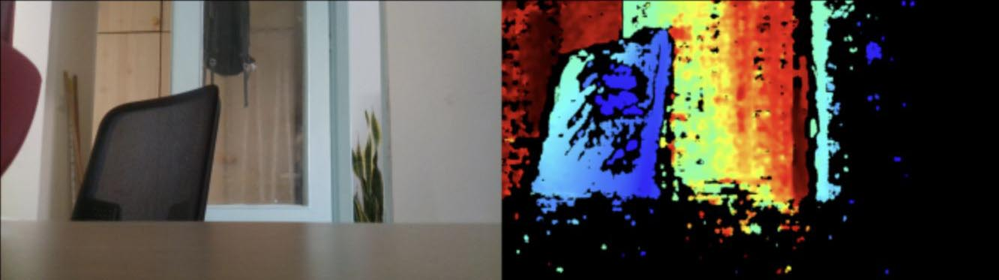
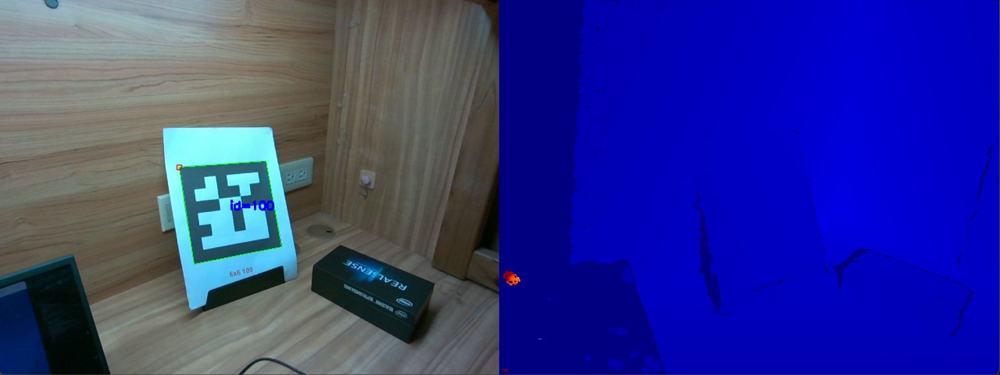
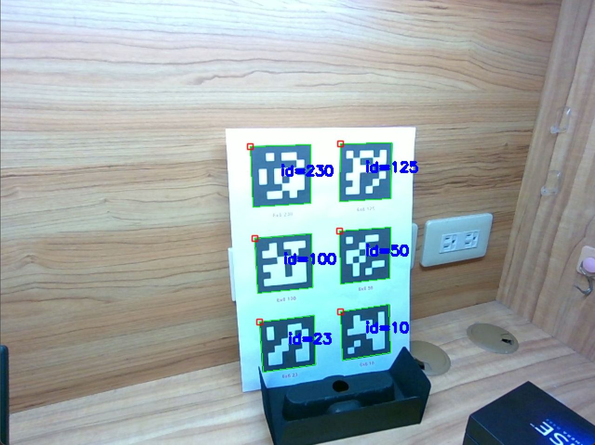

# Lab 1: ArUco Marker Detection

## Introduction

### Intel® RealSense™ Depth Camera D455



- **Ideal Range:** 60 cm ~ 6 m
- **Depth Accuracy:** < 2% at 4 m
- **Captures:** RGB image + Depth

### Calibration Architecture

1. User marks ArUco positions using Meta Quest VR
2. Get the 3D coordinates in Unity from the spatial anchors
3. Get ArUco positions detected by RealSense
4. Find the transformation matrix from RealSense space to Unity space

### Marker Detection Workflow

1. Capture RGB image
2. Detect ArUco using OpenCV
3. Get ArUco pixel coordinates
4. Find ArUco 3D coordinates
5. Calibration (covered next week)

## Sample Code

### RGB and Depth Streaming

#### Installation

```bash
pip install opencv-python
pip install pyrealsense2
```

> **Note**: RealSense SDK only supports Python 3.7 ~ 3.11.

#### Enable streaming

```python
config.enable_stream(stream_type, width, height, format, frame_rate)
```

- **`stream_type`:**  
  Types of data provided by RealSense devices.  
  We will use depth and color.

- **`format`:**  
  Identifies how binary data is encoded within a frame.

#### Start streaming

```python
pipeline.start(config)
```

Start the pipeline streaming according to the configuration.

#### Get color and depth frame

```python
pipeline.wait_for_frames()
```

Wait until a new set of frames becomes available.  
The frames set includes time-synchronized frames of each enabled stream in the pipeline.

#### Display color and depth images using OpenCV



### ArUco Detection

#### Tools

Use `cv2.aruco` for OpenCV ArUco marker detection.

#### Setup Detector

```python
arucoDict = getPredefinedDictionary(ARUCO_DICT[type])
arucoParams = DetectorParameters()
detector = ArucoDetector(arucoDict, arucoParams)
```

- Set the type of ArUco to detect.
- Set detector parameters.
- Create detector.

#### Detect Markers

```python
markerCorners, markerIds, rejectedCandidates = detector.detectMarkers(image)
```

- `markerCorners`: 4 corners of each detected marker
- `markerIds`: IDs of detected markers
- `rejectedCandidates`: Invalid shapes

#### Draw Detected Markers

```python
drawDetectedMarkers(image, markerCorners, markerIds)
```

- Return image with markers drawn.

### Combination

#### Setup detector before streaming

```python
# Enable streaming
config.enable_stream(rs.stream.depth, 640, 480, rs.format.z16, 30)
config.enable_stream(rs.stream.color, 640, 480, rs.format.bgr8, 30)

# Setup ArUco Detector
arucoDict = cv2.aruco.getPredefinedDictionary(cv2.aruco.DICT_6X6_250)
arucoParams = cv2.aruco.DetectorParameters()
arucoDetector = cv2.aruco.ArucoDetector(arucoDict, arucoParams)

# Start streaming
pipeline.start(config)
```

#### Detect ArUco and draw result to each frame

```python
# Wait for a coherent pair of frames: depth and color
frames = pipeline.wait_for_frames()
depth_frame = frames.get_depth_frame()
color_frame = frames.get_color_frame()
if not depth_frame or not color_frame:
    continue

# Convert images to numpy arrays
depth_image = np.asanyarray(depth_frame.get_data())
color_image = np.asanyarray(color_frame.get_data())

# ArUco Detection
corners, ids, rejected = arucoDetector.detectMarkers(color_image)
color_image = cv2.aruco.drawDetectedMarkers(color_image, corners, ids)
```

#### Result



## To Do

### Basic

- Get the **3D coordinates** of ArUco markers.

  ```python
  rs2_deproject_pixel_to_point(depth_intrinsics, [x, y], depth)
  ```

  Use pixel coordinates and depth in an image to get the corresponding point in 3D space.

  - `depth`: `depth_frame.get_distance(x, y)`
    - Get the depth at pixel coordinates.
  - `depth_intrinsics`: `depth_frame.profile.as_video_stream_profile().intrinsics`

- Result:

  

  ```
  { 100: [ 0.010537730529904366,  0.06846068054437637,  0.49000000953674316 ],
  230: [-0.004657267592847347, -0.02919824980199337,  0.49000000953674316 ],
  10: [ 0.11596247553825378,   0.1511079967021942,   0.5230000019073486  ],
  50: [ 0.09865149110555649,   0.054596271365880966, 0.5270000100135803  ],
  125: [ 0.0854126513004303,   -0.04258491471409798,  0.53000003099441531 ] }
  ```

### Bonus

- **Markerless Tracking**: Get 3D coordinates of objects **without** ArUco markers.

  - Use Object Detection and Classification to find pixel coordinates. And use
    RealSense function to find the 3D coordinates.
  - [Point Cloud Library](https://pointclouds.org/)
  - [TensorFlow](https://dev.intelrealsense.com/docs/tensorflow-with-intel-realsense-cameras)
  - [YOLO (real-time object detection)](https://docs.ultralytics.com/)
