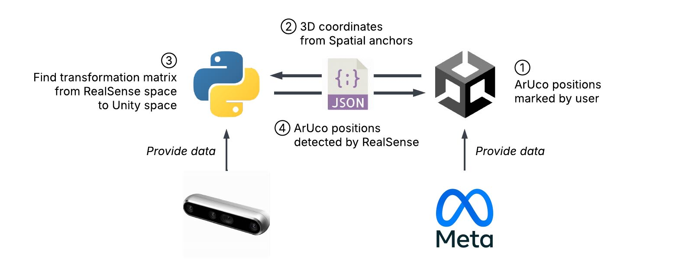

# Lab 2: Calibration

## Introduction



## Installation & Setup

### Meta Quest Link

1. [Download](https://meta.com/zh-tw/help/quest/articles/headsets-and-accessories/oculus-link/set-up-link/) and connect the headset.

2. Go to **Settings → General**.

3. Allow **Unknown Source**.

4. Switch **OpenXR Runtime** to “Set Oculus as Active”.

### Meta XR All-in-One SDK

1. Add the [SDK](https://assetstore.unity.com/packages/tools/integration/meta-xr-all-in-one-sdk-269657) to your Unity sssets.

2. Open **Package Manager** in Unity.

3. Under **My Assets**, install “Meta XR All-in-One SDK”.

### Configurations

In Unity, go to **Project Settings**:

1. In **Oculus → PC (tab)**, and **Meta XR → Android (tab)**:

   - **Fix all** outstanding issues.
   - **Apply all** recommended items.

2. Pick **XR Plug-in Management → PC/Android (both tabs)**:

   - Check the **Oculus** checkbox.

3. Pick **XR Plug-in Management → Oculus (sub-item) → PC (tab)**:

   - Change **Stereo Rendering Mode** to “Multi Pass”.

Then, go to **Build Settings**:

1. Switch to **Android** platform.

2. Refresh **Run Device**.

3. Select **Quest 3**.

## Camera & Controller Tracking

1. Click the **Meta icon** at the bottom right.

2. Open the **Building Blocks** menu.

3. Select (add) the following items:

   - Camera Rig
   - Controller Tracking
   - Passthrough

## Spatial Anchor

Spatial Anchors (`SpatialAnchors.cs`) are stable points in real world tracked by Quest 3.

### OVRInput

- `OVRInput.Get()` – `true` if currently pressed.
- `OVRInput.GetDown()` – `true` if pressed this frame.
- `OVRInput.GetUp()` – `true` if released this frame.

More info from Meta SDK documentation:

- [Control Input Enumerations](https://developers.meta.com/horizon/documentation/unity/unity-ovrinput/#control-input-enumerations)
- [Controller Input Mapping](https://developers.meta.com/horizon/documentation/unity/unity-ovrinput/#virtual-mapping-accessed-as-individual-controllers)
- [Controller Input Mapping (Raw)](https://developers.meta.com/horizon/documentation/unity/unity-ovrinput/#raw-mapping)

### Instantiate Objects

Unity instantiation API:

```csharp
Instantiate(Object original, Vector3 position, Quaternion rotation, Transform parent);
Instantiate(Object original, Vector3 position, Quaternion rotation);
```

## Calibration

1. **Finding transformation matrix $T$**, by solving $n$ linear equations:

   (ArUco $i$, in RealSense) $\left[\begin{matrix}x_i\\y_i\\z_i\end{matrix}\right] \cdot T = \left[\begin{matrix}x'_i\\y'_i\\z'_i\end{matrix}\right]$ (Spatial Anchor $i$, in Unity),
   for $1 \le i \le n$.

2. **Spawn new objects**:

   - RealSense detects a new ArUco code at $(x, y, z)$.
   - Transform to Unity space coordination using $T$.
   - Create a new GameObject in Unity at $(x', y', z')$.

## Server-Client Architecture

### Unity Server (`Server.cs`)

1. Sends message to clients every two second:

   - Spatial Anchor coordinates

2. Create Anchor from ArUco coordinates sent by Python:

   - Create all anchors from Python under the same parent.
   - Implement script to move the parent (manual calibration).

3. Implement your own message format:

   - ArUco ID, coordinates, rotation, etc.

### Python Client

1. Echo message from server:

   - Receive Spatial Anchor positions from Unity.

2. Find the 3D transformation matrix that maps RealSense space to Unity Space.

   - Use `numpy.linalg.lstsq` to find the least square solution.
   - Use the matrix to transform ArUco position detected by RealSense to Unity space.

3. Send ArUco position detected by RealSense to Unity.

## To Do

### Basic

1. Spatial Anchor:

   - Modify the Transform in Anchor Prefab.
   - Add physical objects to controller for user to create anchor at contact area.

2. Implement the calibration process:

   - Users can mark ArUco position with spatial anchors.
   - Users can see and manually adjust the anchors detected by RealSense in VR.

### Hints

- Instantiate all objects from RealSense under the **same parent**.

- Add a script to move the parent object by Quest controller:

  - Every child will move with the parent.
  - Add rotation and movement on z-axis.

- Server client message should support future applications:

  - Spawn new objects in game according to the ArUcos IDs detected:
    - Is it a new one ? or the previous frame didn’t detected it?
  - Track the movement and rotations of ArUco IDs.
    - How to distinguish between error and real movement?
  - Destroy game objects if the ArUco IDs are removed.
    - Is it removed ? or player accidentally blocked it?
