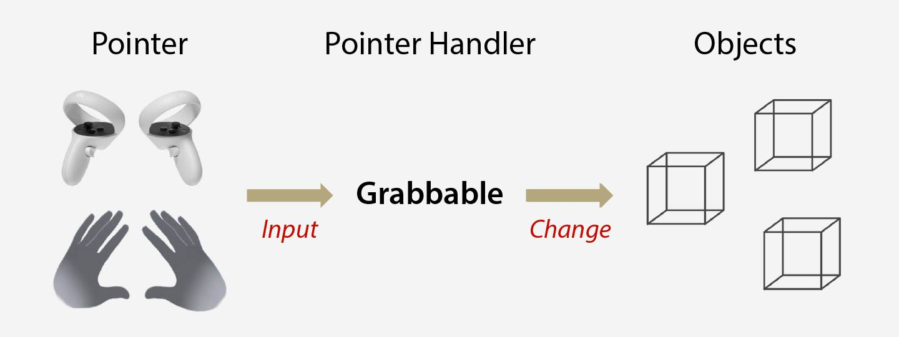
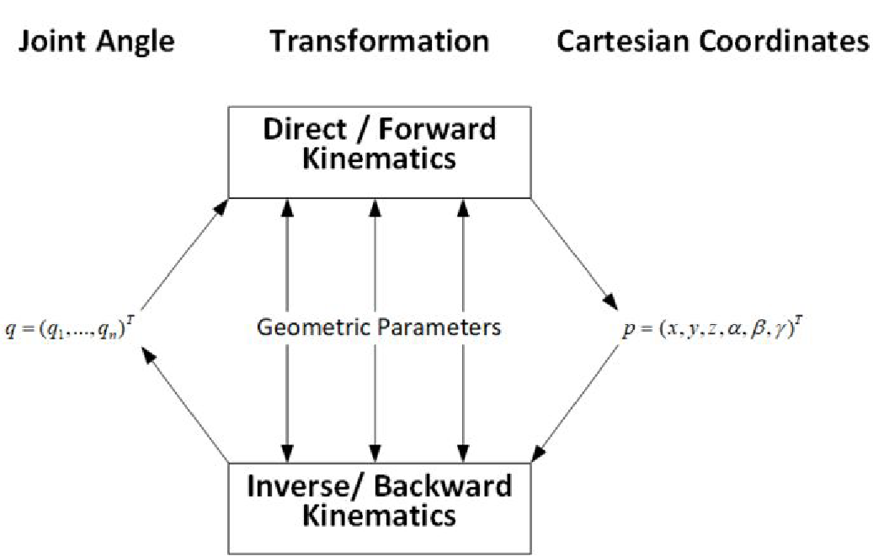

# Lab 3: Body Tracking

## Meta Quest Hand Tracking

### Hand Grab Interactions [(Ref)](https://developer.oculus.com/documentation/unity/unity-isdk-hand-grab-interaction/)

1. Create a plane

   - [Hierarchy] Right click → 3D Object → Plane

2. Add Oculus Interaction Sample Rig

   - [Project] Drag the object to the Hierarchy Window

3. Add a Cube

   - [Hierarchy] Right click → 3D Object → Cube

   - [Inspector] Add Rigidbody

     - ✗ **Gravity**: Whether it falls to the ground.
     - ✓ **Kinematic**: Whether it is affected by physics (forces).

   - [Inspector] Add [Grabbable](https://developer.oculus.com/documentation/unity/unity-isdk-grabbable/)

     - Makes a GameObject rotate, scale, or transform with user interaction.

   - [Inspector] Add [Hand Grab Interactable](https://developer.oculus.com/reference/unity/v67/class_oculus_interaction_hand_grab_hand_grab_interactable/)

     - Makes an object grabbable by hands.

## Pointable Unity Event Wrapper



### Pointer Events

- **Hover**: Being hovered by a pointer.
- **Unhover**: Stopped being hovered by a pointer.
- **Select**: Has performed the Select action.
- **Unselect**: A previous Select state has ended
- **Move**: The pointer was moved on the pointable.
- **Cancel**: Event canceled.

```
      (Hover)            (Select)
None     ⇌     Hovering     ⇌      Selecting
     (Unhover)          (Unselect)
```

### Steps

1. [Inspector] Add Pointable Unity Event Wrapper

   - Then, set the `Pointable` property to `Cube (Grabbable)`.

2. [Inspector] Add a "When Select" PointerEvent

   - Set the object to the cube
   - Set the function to `MeshFilter.mesh` (in `Mesh mesh`)
   - Select `Sphere` to be the mesh
   - This change shape when grabbed

3. [Inspector] Add a "When Unselect" PointerEvent

   - Do the same, but choose `Cube` to be the mesh
   - This change shape back when ungrabbed

## Unity Humanoid Avatar

### Inverse Kinematics (IK)



### Setup

1. Download character from [Mixamo](https://www.mixamo.com/) or NTU COOL.

2. Add the assets to Unity Assets (Project Window).

3. Add Humanoid Rig:

   - [Inspector] "Rig" Tab
   - Animation Type (choose "Humanoid")
   - Click "Apply"

4. Install [Animation Rigging 1.2.1](https://docs.unity3d.com/Packages/com.unity.animation.rigging@1.1/manual/index.html)

5. Setup Bone Renderer:

   - [Hierarchy] Choose the `Y Bot`
   - [Menu Bar] Animation Rigging → Bone Renderer Setup

6. Under `Y Bot`, create an empty GameObject `VR IK Rig`

   - [Inspector] For **VR IK Rig**: add a "Rig"
   - [Inspector] For **Y Bot**: add a "Rig Builder"
     - Rig Layers = `VR IK Rig (Rig)`

7. Under `VR IK Rig`, create an empty GameObject `Right Arm IK`, then:

   - Under it, create two more empty GameObjects

     - `Right Arm IK_target`: Source GameObject that specifies the desired position of the Tip.
     - `Right Arm IK_hint`: Optional Source GameObject, whose position is used to specify the direction the limb should be oriented when it bends.

   - [Inspector] Add "Two Bone IK Constraint"

     - Root = `mixamorig:RightArm (Transform)`
     - Mid = `mixamorig:RightForeArm (Transform)`
     - Tip = `mixamorig:RightHand (Transform)`
     - Source Objects → Target = `Right Arm IK_target (Transform)`
     - Source Objects → Hint = `Right Arm IK_hint (Transform)`

   - [Inspector] Right click on "Two Bone IK Constraint", check "Auto Setup from Tip Transform" option.

8. Align target with tip by:

   - [Hierarchy] Select both `mixamorig:RightHand` (tip) and `Right Arm IK_target` (target)
   - [Menu Bar] Animation Rigging → Align Position

9. Move the hint next to the Avatar

10. Repeat the Step 7-9 for the left hand and the legs.

11. Under `VR IK Rig`, create an empty GameObject `Right Arm IK`, then:

    - Under it, create another empty GameObject `Head Target`

    - [Inspector] Add "Multi-Parent Constraint"

      - Constrainted Object = `mixamorig:Head (Transform)`
      - Source Objects [0] = `Head Target (Transform)`

### Add Walking Animation

For `Right Leg IK_target` and `Left Leg IK_target`:

- [Inspector] Add "IK Foot Solver" (Script):

  - Body: `VR IK Rig (Transform)`
  - Foot Offset = `X = 0`, `Y = 0`, `Z = 0`
  - Foot Rot Offset = `X = -120`, `Y = 180`, `Z = 0`

### Add Follow VR

1. [Hierarchy] Create empty GameObjects

   - `Right Hand VR Target` under `Right hand`
   - `Left Hand VR Target` under `Left hand`
   - `Head VR Target` under `Head`

2. [Inspector] Add "IK Target Follow VR Rig" under **Y Bot**

   - Head → VrTarget = `Head VR Target (Transform)`
   - Head → IkTarget = `Head Target (Transform)`
   - Left Hand → VrTarget = `Left Hand VR Target (Transform)`
   - Left Hand → IkTarget = `Left Arm IK_target (Transform)`
   - Right Hand → VrTarget = `Right Hand VR Target (Transform)`
   - Right Hand → IkTarget = `Right Arm IK_target (Transform)`
   - Head Body Position Offset = `X = 0`, `Y = -0.5`, `Z = 0`
   - Head Body Yaw Offset = `0`

## Python MediaPipe

1. Add Server (`TCP.cs`) in Unity

2. Run the `MediaPipeClient.py` on PC

## Todo

### Basic: Quest Hand Tracking

- **Object A**

  - Change color when the user is **hovering** above.
  - Change to another color when **grabbed**.

- **Object B**

  - Change **shape** when grabbed.
  - Change back to the **original shape** when released.

### Basic: Humanoid Avatar

Implement an avatar that **follows player actions** in Quest 3.

1. Calibrate RealSense and Unity (using Lab 2 callibration).

2. Apply the **transformation matrix** to the human skeleton.

### Bonus

Improve the avatar tracking:

- Increase tracking points → **more precise following**.

- Add animation → **smoother and more complex poses**:

  - [Mixamo animations](https://www.mixamo.com/#/?page=1&type=Motion%2CMotionPack)
  - [Tutorial](https://www.youtube.com/watch?v=2T0hDIoQKNc&t=1s)
