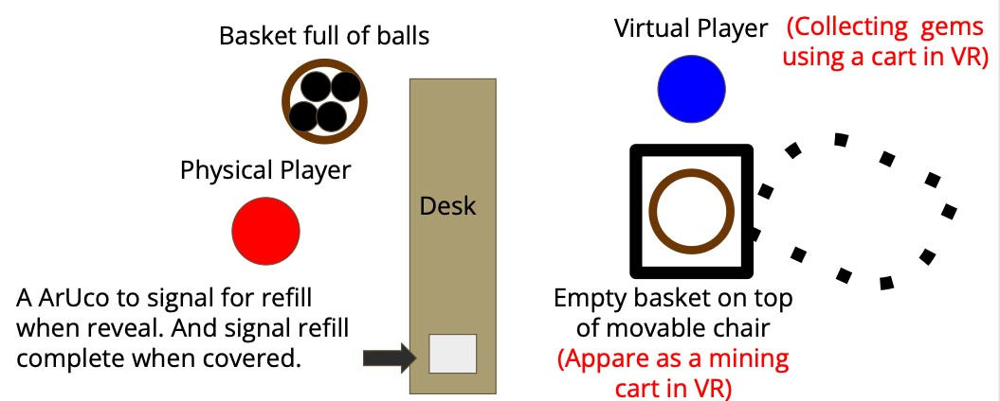
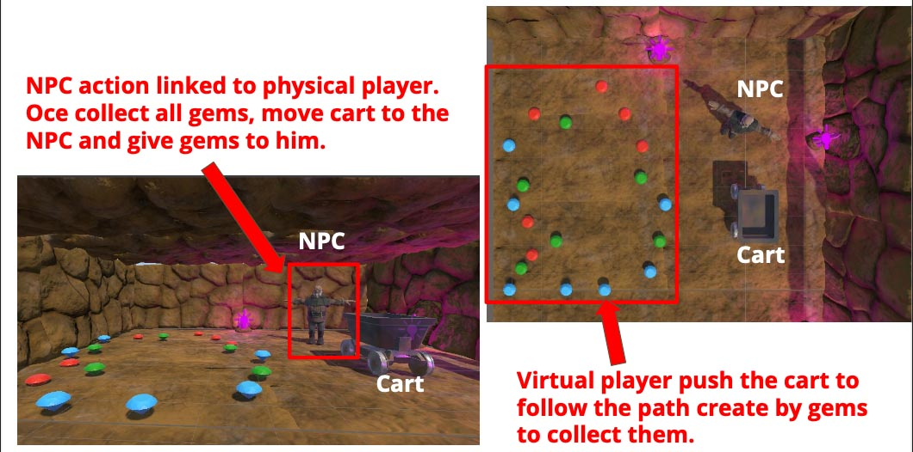
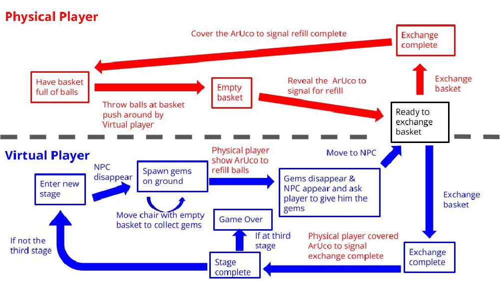

# Lab 4: Game Design

## Unity Collision and Trigger

### Collision Basics

Most game events are triggered by collisions.

- **Colliders with physics, shapes, and mass**

  - Provide realistic interaction.
  - Examples: hitting monsters with weapons, moving objects, walls that players can’t walk through.

- **Colliders without physics and visibility (Triggers)**

  - Detect if game objects enter an area.
  - Examples: kart game checkpoints, triggering a boss fight when enter certain area.

### Collider

- A **3D boundary** that detects collisions.
- Only **collider-to-collider** interactions trigger collision events.
- Parts without colliders will not trigger collisions.

### Adding Collider to a GameObject

- Select and add a collider component.
- For complex shapes, need to use **multiple colliders** or a [**Mesh Collider**](https://docs.unity3d.com/Manual/class-MeshCollider.html)

### Collision States

- **Enter** — Collider touched.
- **Stay** — In contact (called once per frame).
- **Exit** — Stop touching.

### Collision vs Trigger

- **Collision**

  - Physics applied.
  - Handled using **OnCollision** functions.

- **Trigger**

  - No physics applied.
  - Handled using **OnTrigger** functions.

Both messages are sent upon collision.

## Importing Assets

### Unity Asset Store

[Unity Asset Store](https://assetstore.unity.com/) provides:

- Free models, textures, animations
- Project examples
- Tools and extensions

**Steps:**

1. Add an asset to "My Assets" in Unity Assets Store.
2. Open **Package Manager**.
3. Select an asset → Download → Import.
4. Asset becomes available inside your project.

### Other 3D Objects from Web

**Links:**

- [CGTrader ](https://www.cgtrader.com/)
- [SketchFab ](https://sketchfab.com/3d-models)
- [TurboSquid ](https://www.turbosquid.com/)
- [ModelsResource ](https://www.models-resource.com/)
- [Free3D ](https://free3d.com/)

**Steps:**

1. In _Project_ window: **Assets → Import New Asset**
2. Select the model file.
3. Drag imported asset into hierarchy.
4. Unpack prefab to access individual meshes.
5. Drag the imported model into the Scene.

---

## Midterm Demo

### Game Description

Implement a two-player XR game:

- **Physical player (no VR)**
  Throws balls into a moving basket.

- **Virtual player (with VR)**
  Moves a cart (mapped from a physical chair) to collect gems.

- The physical player is **invisible** in VR and interacts only via:

  - ArUco markers
  - Body tracking

### Scenes

**Physical Scene:**

Physical player try to throw balls into the empty basket.  
While virtual player move the chair with empty basket around.

**Virtual Scene:**

### State Machine

### Flow

**Physical world:**

1. Physical player throws balls into moving basket.
2. When out of balls → reveal ArUco to request refill.
3. Virtual player pushes cart (filled with collected gems) back.
4. Physical player exchanges basket and covers ArUco to confirm.
5. Virtual player moves back.
6. Repeat unless virtual player signals game over.

**Virtual World:**

1. NPC asks player to collect gems.
2. Virtual player pushes cart around to collect gems.
3. On refill signal, (1) gems disappear, (2) NPC appears and requests cart.
4. NPC picks up gems (mapped to physical player movements).
5. If third loop → game ends. Otherwise restart with new gem positions.

### Assets

- [Purple Crystal Mine](https://assetstore.unity.com/packages/3d/characters/purple-crystal-mine-113576)

  - Cart
  - Environment

- [Coin Treasure Bundle](https://assetstore.unity.com/packages/3d/props/coin-treasure-bundle-with-animation-3d-250070)

  - Gems & coins

- [Peasant Man](https://www.mixamo.com/#/?page=1&type=Character)

  - NPC to instruct Virtual Player
  - Use Lab 3 to link with physical player
  - Note: Select "Use External Materials (Legacy)" if the avatar has no color

## Todo

Implement the game according to the state machine.

### Basic

- **Calibration works properly**

  - Chair and cart alignment, etc.

- **State machine implemented**

  - Smooth transitions between states.

- **Physical player → NPC mapping**

  - At least **3 tracked points** (head + hands) as in Lab 3.

- **No bugs**

  - No crashes
  - No flying carts
  - NPC not stuck in walls

### Bonus

- Expand the state machine and add extra interactions
- Improve player experience (Physical / Virtual)
- Add SFX, VFX, animations
- Track objects **without ArUco** (Lab 1 Bonus)
- Improve calibration (Lab 2 Bonus)
- Higher-quality NPC action mapping (Lab 3 Bonus)
